

  

  <nobr>
    <!--
--></svg>" width="17.9%" /><!--
--><!--
--></svg>" width="17.9%" /><!--
--><!--
--></svg>" width="17.9%" /><!--
--><!--
--></svg>" width="17.9%" /><!--
-->
  </nobr>

 

  <nobr>
    <!--
--></svg>" width="0.71%" /><!--
--><!--
--></svg>" width="0.71%" /><!--
--><!--
--></svg>" width="0.71%" /><!--
--><!--
--></svg>" width="0.71%" /><!--
--><!--
--></svg>" width="0.71%" /><!--
--><!--
--></svg>" width="0.71%" /><!--
--><!--
--></svg>" width="0.71%" /><!--
--><!--
--></svg>" width="0.71%" /><!--
--><!--
--></svg>" width="0.71%" /><!--
--><!--
--></svg>" width="0.71%" /><!--
--><!--
--></svg>" width="0.71%" /><!--
--><!--
--></svg>" width="0.71%" /><!--
--><!--
--></svg>" width="0.71%" /><!--
--><!--
--></svg>" width="0.71%" /><!--
--><!--
--></svg>" width="0.71%" /><!--
--><!--
--></svg>" width="0.71%" /><!--
--><!--
--></svg>" width="0.71%" /><!--
-->
  </nobr>

  <nobr>
    <!--
--></svg>" width="0.71%" /><!--
--><!--
--></svg>" width="0.71%" /><!--
--><!--
--></svg>" width="0.71%" /><!--
--><!--
--></svg>" width="0.71%" /><!--
--><!--
--></svg>" width="0.71%" /><!--
--><!--
--></svg>" width="0.71%" /><!--
--><!--
--></svg>" width="0.71%" /><!--
--><!--
--></svg>" width="0.71%" /><!--
--><!--
--></svg>" width="0.71%" /><!--
--><!--
--></svg>" width="0.71%" /><!--
--><!--
--></svg>" width="0.71%" /><!--
--><!--
--></svg>" width="0.71%" /><!--
--><!--
--></svg>" width="0.71%" /><!--
--><!--
--></svg>" width="0.71%" /><!--
--><!--
--></svg>" width="0.71%" /><!--
--><!--
--></svg>" width="0.71%" /><!--
--><!--
--></svg>" width="0.71%" /><!--
-->
  </nobr>

  

  <nobr>
    <a href="https://leetcode.com/u/yashthorat">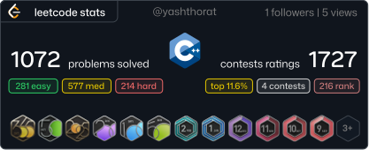</a><!--
--></svg>" width="1.42%" /><!--
--><a href="https://github.com/yashthorat7">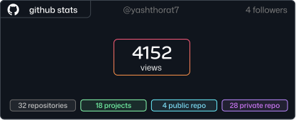</a>
  </nobr>

  

  <nobr>
    <!--
--></svg>" width="1.42%" /><!--
--><a href="https://github.com/yashthorat7/learnrun">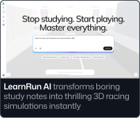</a><!--
--></svg>" width="1.42%" /><!--
--><a href="https://github.com/yashthorat7/rawgen-ai">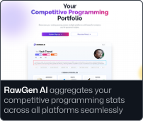</a><!--
--></svg>" width="1.42%" /><!--
-->
  </nobr>

  <nobr>
    <a href="https://github.com/yashthorat7/whilecode">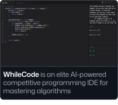</a><!--
--></svg>" width="1.42%" /><!--
--><!--
--></svg>" width="1.42%" /><!--
--><a href="https://github.com/yashthorat7/techathons">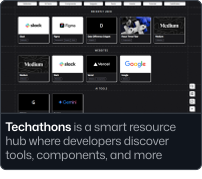</a><!--
--></svg>" width="1.42%" /><!--
--><a href="https://github.com/yashthorat7/findmycandy">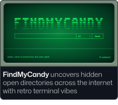</a>
  </nobr>

  <nobr>
    <a href="https://github.com/yashthorat7/musix">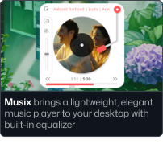</a><!--
--></svg>" width="1.42%" /><!--
--><a href="https://github.com/yashthorat7/pirates-hunt">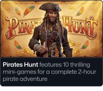</a><!--
--></svg>" width="1.42%" /><!--
--><a href="https://github.com/yashthorat7/password123">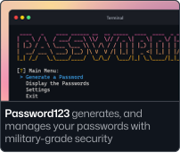</a><!--
--></svg>" width="1.42%" /><!--
--><a href="https://github.com/yashthorat7?tab=repositories">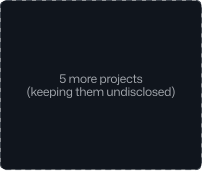</a>
  </nobr>

  

  <nobr>
    <!--
--></svg>" width="1.421%" /><!--
--><!--
--></svg>" width="1.421%" /><!--
-->
  </nobr>

  

